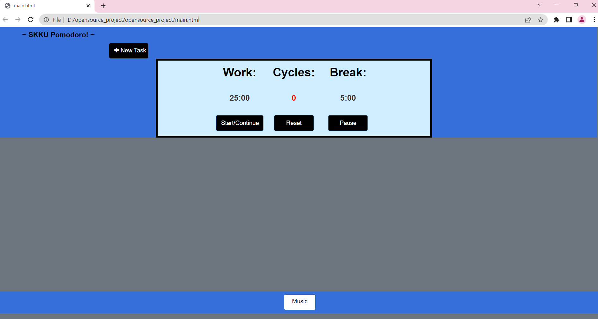
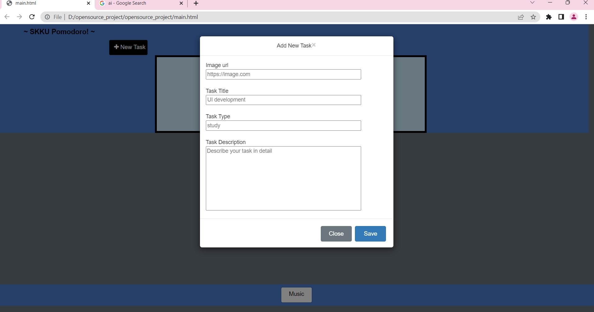
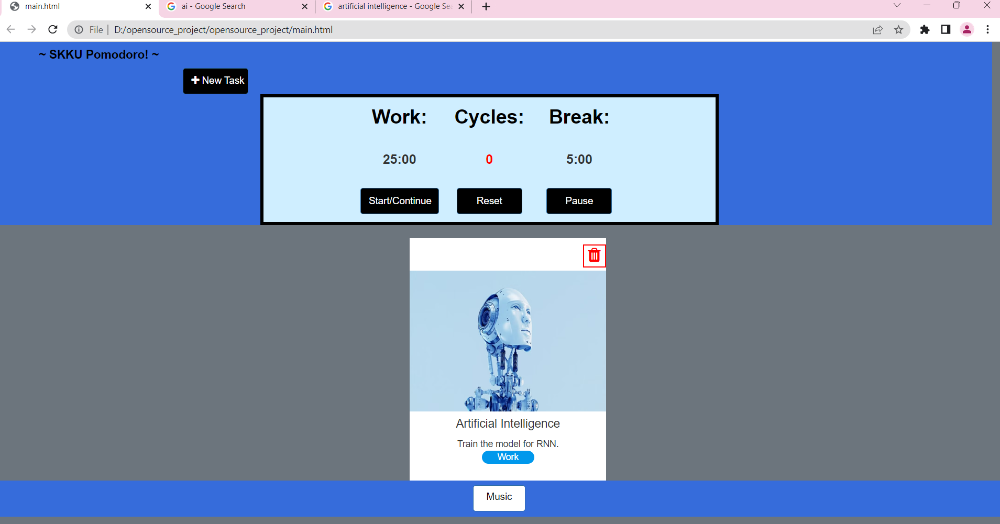
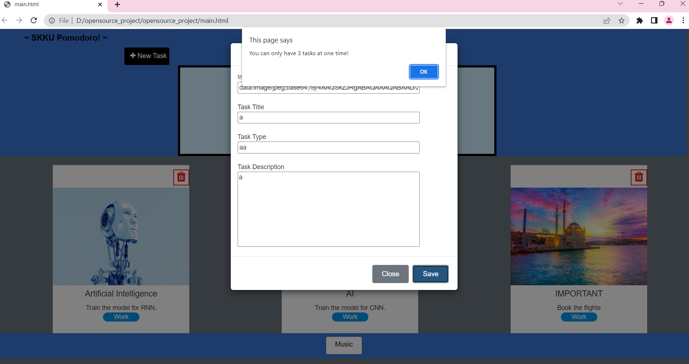

# SKKU POMODORO PROJECT

## Features:

 - The user can organize their tasks that they want to finish in their session.
 - The total task number is limited to three.
 - One cycle is 25 minutes work and 5 minutes rest.
 - If four cycles are finished, the user can take a longer break that is 15 minutes if he/she wants.
 - One task can be specialized by task type, task title, task image, and task description.
 - The user can also choose a different style of music from YouTube playlists to listen while studying/doing the tasks.

## How To Use The Website:
<ol>
 <li> Download the project as zip file. </li>
 <li> Open the zip, and double click the main.html file to open. </li>
 <li> Start using ***SKKU POMODORO***. </li>
 <li> All tasks and preferences will be saved on your browser. </li>
 </ol>

## Screenshots:
 - The beginning:
    
 - Adding a new task:
     
 - When 4 cycles are done, asking for a longer break:
     break") 
 - When a atask is succesfully added:
     
 - When the user tries to add more than 3 tasks without finishing:
     

### Presentation Video
 - [Video Link](https://www.youtube.com/watch?v=FnjDR8gp7AQ&ab_channel=%EB%AF%B8%EB%9D%BC)

### Author
 - Amirah Binti Ahmad Nadzri
 - Selin Samra

### License
Copyright 2022 OS-Team25. All rights reserved.